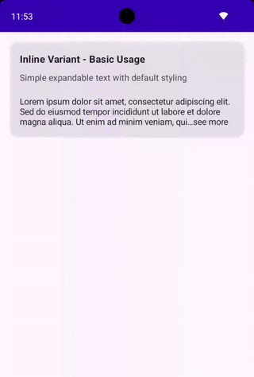
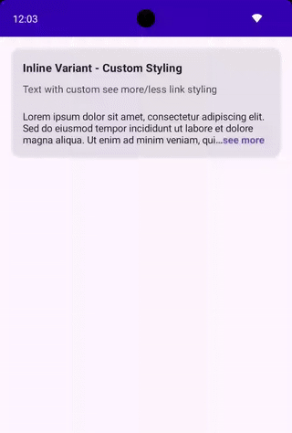
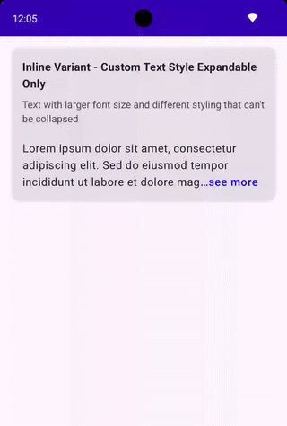
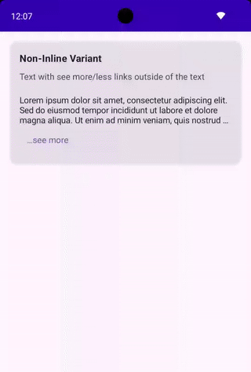
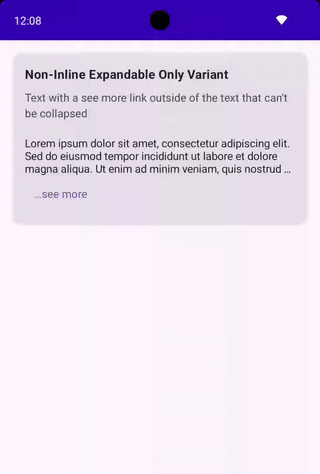

# SeymourText ("See More Text")

A simple and customizable "See More" Text for Jetpack Compose.
Effortlessly create expandable and collapsible material3 `Text` composables that handle overflow.

It supports all KMP targets that are supported by Compose Multiplatform.

### Setup

```
repositories {
  mavenCentral()
}

dependencies {
  implementation("com.eygraber:seymour-text:0.0.20")
}
```

Snapshots can be found [here](https://central.sonatype.org/publish/publish-portal-snapshots/#consuming-via-gradle).

## Usage

Here are some examples of how to use `SeymourText`.

### Inline - Basic Usage
Simple expandable text with default styling.

```kotlin
var isExpanded by remember { mutableStateOf(false) }

SeymourText(
  onSeeMoreChange = { isExpanded = it },
  isSeeMoreExpanded = isExpanded,
  text = "...",
  seeMoreText = "…see more",
  seeLessText = " See less",
  seeMoreMaxLines = 3,
  seeLessMaxLines = Int.MAX_VALUE,
)
```



### Inline - Custom Styling
Text with custom see more/less link styling.

```kotlin
var isExpanded by remember { mutableStateOf(false) }

SeymourText(
  onSeeMoreChange = { isExpanded = it },
  isSeeMoreExpanded = isExpanded,
  text = "...",
  seeMoreText = "…see more",
  seeLessText = " See less",
  seeMoreMaxLines = 3,
  seeLessMaxLines = Int.MAX_VALUE,
  seeMoreStyle = SpanStyle(
    color = MaterialTheme.colorScheme.primary,
    fontWeight = FontWeight.Bold,
    fontSize = 14.sp,
  ),
  seeLessStyle = SpanStyle(
    color = MaterialTheme.colorScheme.secondary,
    fontWeight = FontWeight.Bold,
    fontSize = 14.sp,
  )
)
```



### Inline Variant - Custom Text Style Expandable Only
Text with larger font size and different styling that can't be collapsed.

```kotlin
var isExpanded by remember { mutableStateOf(false) }

SeymourText(
  onSeeMoreChange = { if(it) isExpanded = it },
  isSeeMoreExpanded = isExpanded,
  text = "...",
  seeMoreText = "…see more",
  seeMoreMaxLines = 3,
  seeLessMaxLines = Int.MAX_VALUE,
  style = MaterialTheme.typography.bodyLarge.copy(
    fontSize = 16.sp,
    lineHeight = 24.sp,
  ),
  seeMoreStyle = SpanStyle(
    color = Color.Blue,
    fontWeight = FontWeight.Medium,
  )
)
```



### Non-Inline Variant
Text with see more/less links outside of the text.

```kotlin
var isExpanded by remember { mutableStateOf(false) }

SeymourText(
  isSeeMoreExpanded = isExpanded,
  text = "...",
  seeMoreMaxLines = 3,
  seeLessMaxLines = Int.MAX_VALUE,
  seeMoreContent = {
    TextButton(
      onClick = { isExpanded = !isExpanded },
    ) {
      Text(
        text = if(isExpanded) "See less" else "…see more",
        style = MaterialTheme.typography.bodyMedium.copy(
          color = MaterialTheme.colorScheme.primary,
        ),
      )
    }
  },
)
```



### Non-Inline Expandable Only Variant
Text with a see more link outside of the text that can't be collapsed.

```kotlin
var isExpanded by remember { mutableStateOf(false) }

SeymourText(
  isSeeMoreExpanded = isExpanded,
  text = "...",
  seeMoreMaxLines = 3,
  seeLessMaxLines = Int.MAX_VALUE,
  seeMoreContent = {
    if(!isExpanded) {
      TextButton(
        onClick = { isExpanded = !isExpanded },
      ) {
        Text(
          text = "…see more",
          style = MaterialTheme.typography.bodyMedium.copy(
            color = MaterialTheme.colorScheme.primary,
          ),
        )
      }
    }
  },
)
```


